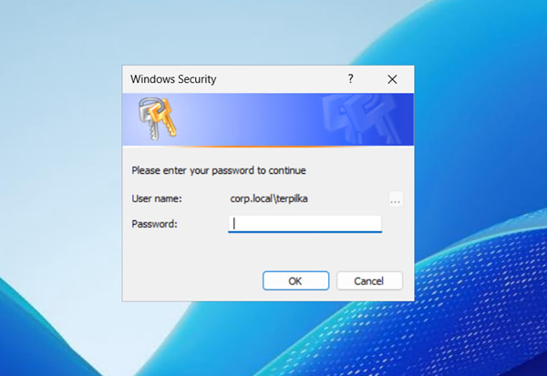

# Windows credential phishing via `CredUIPromptForCredentials`.

## Tested on Windows Server 2025

Inspired by [Phishing for Credentials: If You Want It, Just Ask](https://enigma0x3.net/2015/01/21/phishing-for-credentials-if-you-want-it-just-ask/)

[Полный текст исследования 2026 (2026 Research Full Text](https://forum.duty-free.cc/threads/7787/)

